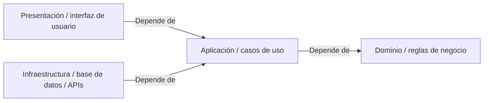
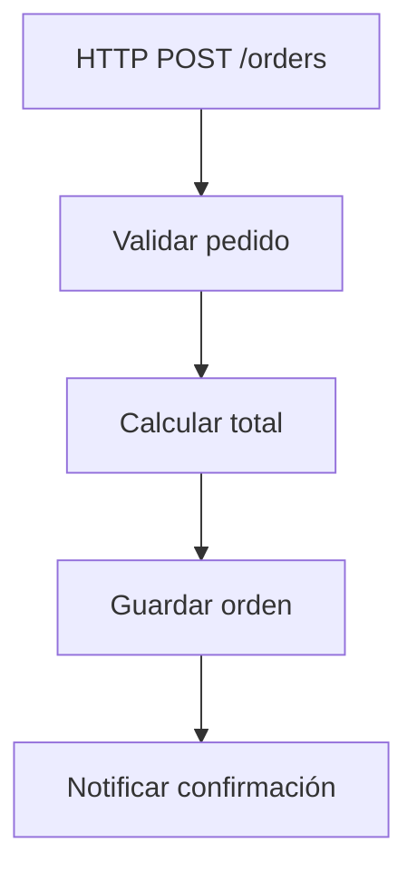

# Cómo enseñamos

Hay muchas formas de aprender programación, y cada una sirve mejor para cosas distintas.

  
:material-book-open-page-variant-outline: <strong>Documentación</strong>

  
Obtienes bienReferencia precisa, interfaces de programación (APIs), opciones y comportamiento esperado.

  
Puede quedar menos claroPor qué una decisión existe o cuándo deja de ser útil.

  
:material-school-outline: <strong>Tutoriales</strong>

  
Obtienes bienUn camino concreto para llegar a un resultado.

  
Puede quedar menos claroQué partes del camino eran necesarias y cuáles eran circunstanciales.

  
:material-play-circle-outline: <strong>Videos</strong>

  
Obtienes bienExplicación guiada, ritmo y demostración visual.

  
Puede quedar menos claroCómo reconstruir la idea fuera del ejemplo mostrado.

  
:material-layers-outline: <strong>Copiar una arquitectura</strong>

  
Obtienes bienUna estructura funcional que puedes reutilizar rápido.

  
Puede quedar menos claroQué problema justificaba cada capa, interfaz o separación.

  
:material-brain: <strong>Memorizar un patrón</strong>

  
Obtienes bienVocabulario y reconocimiento de una forma conocida.

  
Puede quedar menos claroCuándo el patrón es necesario, innecesario o incluso contraproducente.

Todas pueden ser útiles.

Teaching intenta concentrarse especialmente en aquello que suele quedar menos visible: **la relación entre el problema, la decisión y el concepto que aparece después**.

Queremos que puedas mirar una decisión de software y pensar:

> **"Entiendo por qué esto apareció."**

No solamente cómo se llama.

---

## El problema con empezar por la respuesta

Imagina que queremos enseñar **arquitectura limpia** (Clean Architecture).

Podríamos comenzar mostrándote directamente el diagrama típico de dependencias:

<strong>En texto:</strong> <strong>Presentación</strong> e <strong>Infraestructura</strong> dependen de <strong>Aplicación</strong>; <strong>Aplicación</strong> depende de <strong>Dominio</strong>.

Eso sería correcto.

Incluso podríamos resumirlo con una regla conocida: **las dependencias apuntan hacia adentro.**

Pero aparece una pregunta bastante importante: **¿por qué necesitábamos todo esto?**

### Tener la respuesta no te da la experiencia
Si nunca experimentaste el problema que motivó esas separaciones, la arquitectura corre el riesgo de convertirse en una receta.

Por eso preferimos comenzar con algo mucho menos impresionante:

<strong>En texto:</strong> recibimos una orden por HTTP, la validamos, calculamos su total, la guardamos y finalmente notificamos la confirmación.

Un flujo pequeño, lineal y razonable, que funciona y no requiere nada que arreglar... todavía.

**Acá no necesitamos una arquitectura elaborada**, pero empezamos a cambiar una cosa a la vez:

1

**La lógica crece**

La operación deja de ser trivial.

2

**Queremos probarla**

Necesitamos aislar comportamiento para verificarlo.

3

**Aparece una dependencia externa**

Persistencia, correo, APIs u otros servicios entran al flujo.

4

**Necesitamos otro punto de entrada**

El mismo comportamiento debe poder ejecutarse desde otro lugar.

Y, poco a poco, empiezan a existir **razones reales para mover cosas**.

Cuando finalmente aparecen conceptos como **caso de uso**, **puerto**, **adaptador** o **inversión de dependencias**, ya tenemos algo a lo que conectarlos.

Ese es el tipo de aprendizaje que buscamos.

---

## Nuestros pilares y mandamientos

Los **pilares** resumen qué intentamos preservar. Los **mandamientos** convierten esa intención en criterios concretos para enseñar.

### Pilares

:material-alert-decagram-outline: **1. Problem-first learning**
Aprendizaje desde el problema

Primero aparece el problema.

Después, cuando ya existe una razón para resolverlo, aparece el concepto.

:material-auto-fix: **2. Lecciones generativas**

Una explicación no debería estar atrapada en un solo ejemplo.

Queremos que puedas reconstruirla con otro lenguaje, dominio o nivel de dificultad.

:material-source-branch: **3. Transparencia de decisiones**

No queremos mostrarte únicamente dónde terminó el código.

Queremos que puedas seguir el camino que lo llevó hasta ahí.

---

### Mandamientos

No son leyes universales de ingeniería de software.

Son compromisos sobre **cómo queremos enseñar**.

I

No mover una línea sin una causa

Si agregamos una interfaz, una capa o una abstracción, deberías poder señalar el problema que hizo útil ese cambio.

II

El código inicial puede estar bien

No necesitamos convertir la primera versión en un desastre artificial para justificar una arquitectura más sofisticada.

A veces una solución sencilla es exactamente la solución correcta.

III

Nombrar después de entender

Siempre que podamos, queremos que primero aparezca la intuición y después el término formal.

IV

Preguntar “¿y si no hacemos nada?”

Una decisión se entiende mejor cuando también conocemos el costo de no tomarla.

V

Enseñar cuándo no usar algo

Saber aplicar un patrón es útil.

Saber cuándo sería sobrearquitectura es todavía más útil.

VI

Una visual, una pregunta

Un diagrama debería ayudarte a ver algo específico.

Si necesita explicar cinco ideas al mismo tiempo, probablemente necesitamos cinco visuales más pequeños.

VII

Cambiar una variable

¿Qué pasa si reemplazamos HTTP por una interfaz de línea de comandos (CLI)?

¿Y SQL por archivos?

¿Y si tenemos tres puntos de entrada en vez de uno?

Cambiar una sola condición nos permite descubrir qué partes del diseño eran esenciales y cuáles eran accidentales.

VIII

Distinguir hechos de preferencias

No todo lo que hacemos en software es una ley.

Hay propiedades técnicas, restricciones, convenciones, heurísticas y preferencias.

Intentaremos decir cuál es cuál.

IX

Mostrar el razonamiento, no solamente el resultado

El código final es un artefacto.

Lo que queremos enseñar es el camino.

---

## El uso de IA en Teaching

Parte del contenido de Teaching puede ser ideado, discutido, revisado, transformado o generado con ayuda de inteligencia artificial. Pero queremos usarla de una manera un poco distinta.

En lugar de pedir: "Explícame arquitectura limpia (Clean Architecture)", preferimos construir primero una **especificación pedagógica**.

Objetivo
<strong>Qué debe entender la persona</strong>

Recorrido
<strong>Qué problemas deben aparecer y en qué orden</strong>

Límites
<strong>Qué conceptos todavía no deben introducirse</strong>

Representación
<strong>Qué material visual necesitamos</strong>

Calidad
<strong>Qué errores pedagógicos queremos evitar</strong>

Esa especificación puede reutilizarse para producir nuevas realizaciones. Por eso algunas lecciones publican también sus **instrucciones base de generación**: la **fuente pedagógica** desde la que esas realizaciones pueden derivarse.

### Una fuente, muchas realizaciones

Una explicación publicada no tiene por qué ser la única forma de enseñar una idea.

Las **instrucciones base de generación** conservan aquello que queremos mantener estable: la intención pedagógica, las tensiones que deben aparecer, su orden, los límites y los criterios de calidad.

Desde esa fuente podemos producir distintas realizaciones según lo que una persona necesite.

Cambiar contexto
<strong>Otro lenguaje o dominio</strong>
Por ejemplo: Python + videojuegos en vez de C# + órdenes.

Cambiar dificultad
<strong>Práctica, intermedio o avanzado</strong>
La profundidad cambia sin adelantar conceptos que todavía no corresponden.

Otra explicación
<strong>El ejemplo anterior no me quedó claro</strong>
Podemos cambiar la representación sin cambiar aquello que intentamos enseñar.

Material visual
<strong>Diagramas, comparaciones o secuencias</strong>
La misma intención puede expresarse con otra forma de representación.

Práctica y evaluación
<strong>Ejercicios, preguntas o desafíos</strong>
Podemos derivar material para practicar o comprobar comprensión.

### La IA puede realizar; no define la fuente

La IA puede ayudarnos a transformar una fuente pedagógica en una explicación, un ejemplo, un diagrama, un ejercicio o una variante para otro nivel.

Pero generar una realización no demuestra que esa realización sea correcta.

1
<strong>Fuente pedagógica</strong>
<small>Define qué intentamos enseñar y qué debe preservarse.</small>

→

2
<strong>Realización</strong>
<small>Decide cómo expresarlo para una necesidad concreta.</small>

→

3
<strong>Revisión</strong>
<small>Comprueba intención pedagógica, afirmaciones, ejemplos y código.</small>

→

4
<strong>Publicación</strong>
<small>La realización revisada pasa a formar parte del material.</small>

<strong>En texto:</strong> partimos desde una fuente pedagógica, producimos una realización, la revisamos y solo después la publicamos.

---

## Lecciones y guías

Teaching crecerá principalmente con dos tipos de contenido.

<a class="content-type-card" href="../../lessons/">
Lección
<strong>“Quiero entender esto.”</strong>
Construye intuición alrededor de un concepto.
Explorar lecciones →
</a>

<a class="content-type-card" href="../../guides/">
Guía
<strong>“Quiero lograr esto.”</strong>
Conecta conocimiento para alcanzar un objetivo real.
Ver guías →
</a>

Una guía puede componer varias lecciones sin volver a explicarlas desde cero.

Por ejemplo, una futura guía sobre **cómo hacer que una API existente sea fácil de probar** podría apoyarse en lecciones sobre pruebas, dependencias, puertos y diseño de dominio.
