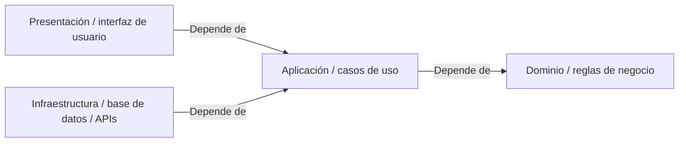
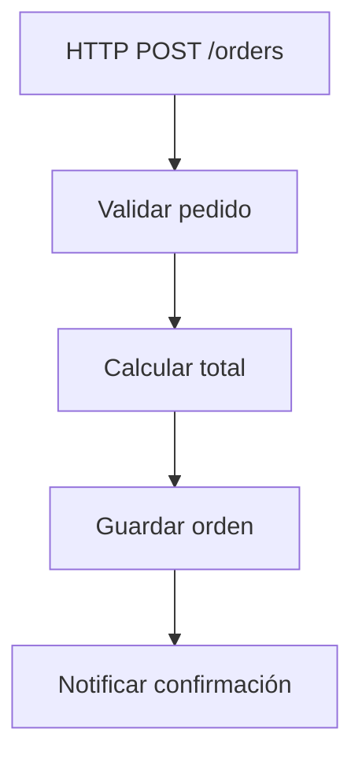

---
hide:
  - navigation
---

# Cómo enseñamos

Hay muchas formas de aprender programación, y cada una sirve mejor para cosas distintas.

  
:material-book-open-page-variant-outline: <strong>Documentación</strong>

  
Obtienes bienReferencia precisa, interfaces de programación (APIs), opciones y comportamiento esperado.

  
Puede quedar menos claroPor qué una decisión existe o cuándo deja de ser útil.

  
:material-school-outline: <strong>Tutoriales</strong>

  
Obtienes bienUn camino concreto para llegar a un resultado.

  
Puede quedar menos claroQué partes del camino eran necesarias y cuáles eran circunstanciales.

  
:material-play-circle-outline: <strong>Videos</strong>

  
Obtienes bienExplicación guiada, ritmo y demostración visual.

  
Puede quedar menos claroCómo reconstruir la idea fuera del ejemplo mostrado.

  
:material-layers-outline: <strong>Copiar una arquitectura</strong>

  
Obtienes bienUna estructura funcional que puedes reutilizar rápido.

  
Puede quedar menos claroQué problema justificaba cada capa, interfaz o separación.

  
:material-brain: <strong>Memorizar un patrón</strong>

  
Obtienes bienVocabulario y reconocimiento de una forma conocida.

  
Puede quedar menos claroCuándo el patrón es necesario, innecesario o incluso contraproducente.

Todas pueden ser útiles.

Teaching intenta concentrarse especialmente en aquello que suele quedar menos visible: **la relación entre el problema, la decisión y el concepto que aparece después**.

Queremos que puedas mirar una decisión de software y pensar:

> **"Entiendo por qué esto apareció."**

No solamente cómo se llama.

---

## El problema con empezar por la respuesta

Imagina que queremos enseñar **arquitectura limpia** (Clean Architecture).

Podríamos comenzar mostrándote directamente el diagrama típico de dependencias:

<strong>En texto:</strong> <strong>Presentación</strong> e <strong>Infraestructura</strong> dependen de <strong>Aplicación</strong>; <strong>Aplicación</strong> depende de <strong>Dominio</strong>.

Eso sería correcto.

Incluso podríamos resumirlo con una regla conocida: **las dependencias apuntan hacia adentro.**

Pero aparece una pregunta bastante importante: **¿por qué necesitábamos todo esto?**

### Tener la respuesta no te da la experiencia
Si nunca experimentaste el problema que motivó esas separaciones, la arquitectura corre el riesgo de convertirse en una receta.

Por eso preferimos comenzar con algo mucho menos impresionante:

<strong>En texto:</strong> recibimos una orden por HTTP, la validamos, calculamos su total, la guardamos y finalmente notificamos la confirmación.

Un flujo pequeño, lineal y razonable, que funciona y no requiere nada que arreglar... todavía.

**Acá no necesitamos una arquitectura elaborada**, pero empezamos a cambiar una cosa a la vez:

1

**La lógica crece**

La operación deja de ser trivial.

2

**Queremos probarla**

Necesitamos aislar comportamiento para verificarlo.

3

**Aparece una dependencia externa**

Persistencia, correo, APIs u otros servicios entran al flujo.

4

**Necesitamos otro punto de entrada**

El mismo comportamiento debe poder ejecutarse desde otro lugar.

Y, poco a poco, empiezan a existir **razones reales para mover cosas**.

Cuando finalmente aparecen conceptos como **caso de uso**, **puerto**, **adaptador** o **inversión de dependencias**, ya tenemos algo a lo que conectarlos.

Ese es el tipo de aprendizaje que buscamos.

---

## Nuestros pilares y mandamientos

Los **pilares** resumen qué intentamos preservar. Los **mandamientos** convierten esa intención en criterios concretos para enseñar.

### Nuestros 3 pilares

### :material-alert-decagram-outline: 1. Aprendizaje desde el problema

Problem-first learning

Primero aparece el problema.

Después, cuando ya existe una razón para resolverlo, aparece el concepto.

### :material-auto-fix: 2. Lecciones generativas

Una explicación no debería estar atrapada en un solo ejemplo.

Queremos que puedas reconstruirla con otro lenguaje, dominio o nivel de dificultad.

### :material-source-branch: 3. Transparencia de decisiones

No queremos mostrarte únicamente dónde terminó el código.

Queremos que puedas seguir el camino que lo llevó hasta ahí.

---

### Mandamientos

No son leyes universales de ingeniería de software.

Son compromisos sobre **cómo queremos enseñar**.

### No mover una línea sin una causa

Si agregamos una interfaz, una capa o una abstracción, deberías poder señalar el problema que hizo útil ese cambio.

### El código inicial puede estar bien

No necesitamos convertir la primera versión en un desastre artificial para justificar una arquitectura más sofisticada.

A veces una solución sencilla es exactamente la solución correcta.

### Nombrar después de entender

Siempre que podamos, queremos que primero aparezca la intuición y después el término formal.

### Preguntar "¿y si no hacemos nada?"

Una decisión se entiende mejor cuando también conocemos el costo de no tomarla.

### Enseñar cuándo **no** usar algo

Saber aplicar un patrón es útil.

Saber cuándo sería sobrearquitectura es todavía más útil.

### Una visual, una pregunta

Un diagrama debería ayudarte a ver algo específico.

Si necesita explicar cinco ideas al mismo tiempo, probablemente necesitamos cinco visuales más pequeños.

### Cambiar una variable

¿Qué pasa si reemplazamos HTTP por una interfaz de línea de comandos (CLI)?

¿Y SQL por archivos?

¿Y si tenemos tres puntos de entrada en vez de uno?

Cambiar una sola condición nos permite descubrir qué partes del diseño eran esenciales y cuáles eran accidentales.

### Distinguir hechos de preferencias

No todo lo que hacemos en software es una ley.

Hay propiedades técnicas, restricciones, convenciones, heurísticas y preferencias.

Intentaremos decir cuál es cuál.

### Mostrar el razonamiento, no solamente el resultado

El código final es un artefacto.

Lo que queremos enseñar es el camino.

---

## Y sí: usamos IA

No queremos esconderlo.

Parte del contenido de Teaching puede ser ideado, discutido, revisado, transformado o generado con ayuda de inteligencia artificial.

Pero queremos usarla de una manera un poco distinta.

En lugar de pedir:

> "Explícame arquitectura limpia (Clean Architecture)."

podemos construir primero una especificación pedagógica que diga:

- qué debe entender la persona;
- qué problemas deben aparecer;
- en qué orden;
- qué conceptos todavía **no** deben introducirse;
- qué material visual necesitamos;
- qué errores pedagógicos queremos evitar.

Después esa especificación puede utilizarse para producir nuevas variantes.

Por eso algunas lecciones incluyen sus **instrucciones de generación**.

Puedes pensarlas como una especie de código fuente de la explicación.

---

## Una lección, muchos ejemplos

Supongamos que una explicación usa C# y un sistema de órdenes, pero tú trabajas con Python y videojuegos.

No deberías tener que empezar desde cero.

Podrías tomar las instrucciones de generación y pedir:

> Adapta esta lección a Python y FastAPI. Cambia el caso de "crear una orden" por "crear una partida", pero conserva las mismas tensiones y el mismo orden pedagógico.

O:

> Genera tres variantes de esta etapa. Una para alguien en práctica, otra para nivel intermedio y otra para nivel avanzado. No adelantes conceptos de etapas posteriores.

O incluso:

> Dame otro ejemplo porque el anterior no me quedó claro.

El objetivo es que el contenido pueda adaptarse **sin perder aquello que intentaba enseñar**.

---

## La IA no es la fuente de verdad

Las instrucciones de generación tampoco convierten cualquier respuesta de una IA en material correcto.

Los ejemplos necesitan revisión.

El código necesita revisión.

Las afirmaciones técnicas necesitan revisión.

La intención pedagógica necesita revisión.

La ventaja es otra: ahora el proceso que genera nuevas explicaciones es visible y reutilizable.

---

## Lecciones y guías

Teaching crecerá principalmente con dos tipos de contenido.

### Lecciones

Para cuando dices:

> **"Quiero entender esto."**

Una lección intenta construir una intuición alrededor de un concepto.

### Guías

Para cuando dices:

> **"Quiero lograr esto."**

Una guía podrá conectar varias lecciones y convertirlas en un recorrido orientado a un objetivo real.

Así, por ejemplo, una futura guía sobre **cómo hacer que una API existente sea fácil de probar** podría apoyarse en lecciones sobre pruebas, dependencias, puertos y diseño de dominio sin volver a explicarlas desde cero.

---

## ¿Y hacia dónde puede crecer esto?

Hay una posibilidad que nos interesa especialmente.

En ingeniería de software muchas ideas nacen porque alguien se encontró repetidamente con un problema.

Teaching puede transformarse en un lugar donde esos problemas queden expuestos, reproducibles y explorables.

Eso conecta naturalmente con iniciativas como **VSlices**, donde parte importante del trabajo consiste precisamente en entender tensiones de diseño, hacer explícitas decisiones y estudiar qué estructuras emergen de ellas.

No necesitamos decidir hoy cuánto se conectarán ambos proyectos.

Pero sí queremos conservar algo desde el principio:

> **el problema debe permanecer visible detrás de la solución.**

Porque cuando desaparece el problema y queda solamente el patrón, es muy fácil terminar memorizando arquitectura en lugar de aprender a diseñar.
