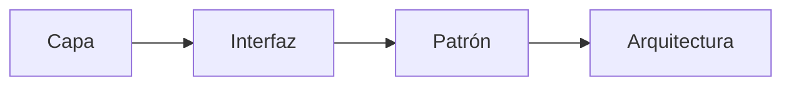

# Cómo generamos una lección

Una lección de Teaching no empieza necesariamente como una página terminada.

Antes de decidir el ejemplo, el lenguaje, los diagramas o incluso la forma exacta de explicarla, intentamos conservar algo más estable: **qué queremos que una persona llegue a entender y qué recorrido hace que esa comprensión tenga sentido**.

A eso lo tratamos como la **fuente pedagógica** de la lección.

En Teaching, esa fuente se expresa normalmente mediante unas **instrucciones base de generación**: un artefacto que conserva la intención, el recorrido, los límites y las condiciones que no deberían perderse al producir distintas versiones de una misma lección.

## Primero definimos qué debe permanecer

Una buena fuente debería dejar suficientemente claras tres cosas:

Intención
<strong>Qué queremos que la persona comprenda</strong>
Qué debería entender al terminar y qué todavía no necesita aprender.

Recorrido
<strong>Qué debe ocurrir para que esa comprensión tenga sentido</strong>
Qué problemas o tensiones deben aparecer y en qué orden importa que aparezcan.

Límites y acceso
<strong>Qué no debería desaparecer de la explicación</strong>
Qué costos, límites y condiciones de accesibilidad o acceso material debemos respetar.

No necesitamos decidir desde el comienzo cada frase, diagrama o ejercicio.

Sí necesitamos saber **qué debe permanecer estable aunque cambie la forma de enseñar**.

## El recorrido debe tener causas

Preferimos un recorrido donde cada paso aparezca como respuesta a una necesidad visible.

Una secuencia como esta puede mostrar el resultado, pero no todavía las causas:

<strong>En texto:</strong> la secuencia muestra capa → interfaz → patrón → arquitectura; por sí sola no explica por qué apareció cada concepto.

En su lugar, preferimos que la explicación conserve una relación causal:

1
<strong>Algo funciona</strong>
Partimos desde una solución suficientemente simple y razonable.

→

2
<strong>Cambia una condición</strong>
Aparece un requisito, más uso o un contexto diferente.

→

3
<strong>Aparece una limitación</strong>
La solución actual deja de responder bien a la nueva situación.

→

4
<strong>Exploramos</strong>
Consideramos qué podríamos hacer y qué consecuencias tendría.

→

5
<strong>Hacemos el cambio mínimo</strong>
Introducimos solamente lo necesario para responder al problema visible.

→

6
<strong>Ponemos nombre</strong>
El concepto aparece después de que ya existe algo que reconocer.

→

7
<strong>Observamos costos y límites</strong>
Vemos dónde ayuda, qué cuesta y cuándo deja de tener sentido.

<strong>En texto:</strong> partimos desde algo que funciona; cambia una condición; aparece una limitación; exploramos alternativas; hacemos el cambio mínimo útil; recién entonces ponemos nombre al concepto y observamos sus costos y límites.

No todas las lecciones necesitan seguir exactamente esos pasos. Un ejemplo pequeño de ese recorrido podría verse así:

<strong>Un endpoint funciona</strong>

→

<strong>crecen las reglas de negocio</strong>

→

<strong>necesitamos probarlas sin HTTP</strong>

→

<strong>aparece una operación separable</strong>

→

<strong>la reconocemos como un caso de uso</strong>

<strong>En texto:</strong> el caso de uso no aparece porque queríamos aplicar una arquitectura; aparece después de que una necesidad concreta vuelve útil separar esa operación.

## Una fuente puede tener muchas realizaciones

La misma intención pedagógica puede expresarse de distintas formas.

Lenguaje
<strong>C#, Python u otro</strong>
Cambia la herramienta, no aquello que intentamos enseñar.

Dominio
<strong>Órdenes, videojuegos, inventario...</strong>
El contexto puede acercar la idea sin alterar su recorrido esencial.

Dificultad
<strong>Más o menos profundidad</strong>
Podemos adaptar cuánto asumimos y cuánto acompañamiento necesita la persona.

Representación
<strong>Texto, código, diagramas o ejercicios</strong>
La forma cambia según qué ayude mejor a comprender la tensión actual.

Interacción
<strong>Lectura, tutoría o práctica guiada</strong>
La misma fuente puede convertirse en experiencias de aprendizaje distintas.

Ayuda
<strong>Más o menos andamiaje</strong>
Podemos variar pistas, ejemplos y apoyo sin adelantar conceptos innecesarios.

Eso nos permite producir realizaciones distintas sin perder necesariamente la misma intención pedagógica.

Aunque la forma cambie, hay algunas cosas que deberían permanecer reconocibles:

1
<strong>Intención pedagógica</strong>
Qué debería comprender la persona al terminar.

2
<strong>Tensiones esenciales</strong>
Qué problemas deben aparecer para que el concepto tenga una causa visible.

3
<strong>Límites</strong>
Qué costos, contrafactuales y condiciones no deberían desaparecer.

4
<strong>Momento de introducir conceptos</strong>
Qué todavía no corresponde nombrar o enseñar.

<strong>En texto:</strong> una realización puede cambiar lenguaje, dominio, dificultad, representación, interacción o cantidad de ayuda; no debería cambiar silenciosamente la intención, las tensiones esenciales, los límites ni el momento en que aparecen los conceptos.

La fuente tampoco es inmutable.

Una realización puede enseñarnos que la secuencia no funciona como esperábamos, que una tensión aparece demasiado pronto, que falta una transición o que estamos intentando enseñar demasiadas cosas a la vez.

<strong>Fuente pedagógica</strong>
Declara qué intentamos preservar.

→

<strong>Realización</strong>
Expresa esa intención de una forma concreta.

→

<strong>Evidencia</strong>
La experiencia revela qué funcionó, qué faltó o qué apareció demasiado pronto.

↺

<strong>Revisión de la fuente</strong>
Actualizamos la intención o el recorrido cuando la evidencia lo justifica.

<strong>En texto:</strong> la fuente produce realizaciones, pero las realizaciones también producen evidencia que puede justificar revisar la fuente.

## Las condiciones de acceso también son parte de la generación

No queremos diseñar una explicación y preguntarnos por accesibilidad recién al final.

Mientras generamos una lección intentamos no asumir innecesariamente ciertas condiciones de acceso:

Costo
<strong>Software o servicios pagados</strong>
No asumimos que una persona pueda pagar herramientas, plataformas o suscripciones para aprender el concepto.

Hardware
<strong>Equipos potentes</strong>
No asumimos computadores de alto rendimiento cuando el objetivo pedagógico puede alcanzarse con recursos más modestos.

Conectividad
<strong>Conexiones rápidas o estables</strong>
No convertimos una buena conexión a internet en un requisito implícito cuando no es técnicamente necesaria.

Trayectoria
<strong>Educación formal o certificaciones</strong>
No usamos universidad, certificaciones o formación costosa como filtro innecesario para acceder a una explicación.

Idioma
<strong>Dominio previo del inglés</strong>
No asumimos que una persona ya comprende términos en inglés que todavía no hemos explicado.

Accesibilidad
<strong>Condiciones visuales, físicas o sensoriales ideales</strong>
No diseñamos la experiencia suponiendo que todas las personas acceden al contenido de la misma forma.

En su lugar, intentamos tomar decisiones de generación que reduzcan barreras innecesarias:

1
<strong>Intuición antes del tecnicismo</strong>
Cuando un término técnico todavía no es necesario, preferimos construir primero la intuición que lo vuelve comprensible.

2
<strong>Traducción visible</strong>
Cuando usamos un término en inglés que importa para comprender la idea, mostramos también su significado en español.

3
<strong>Acceso alternativo</strong>
Cuando una representación visual contiene información esencial, procuramos que exista una forma textual de acceder a ella.

4
<strong>Diseño desde el inicio</strong>
La accesibilidad y las condiciones materiales forman parte de la generación de la lección, no de una revisión posterior.

<strong>En texto:</strong> generar una lección también implica decidir desde qué condiciones de acceso estamos enseñando. No solo importa qué explicamos, sino también qué barreras introduce la forma en que lo explicamos.

## Una fuente incompleta no es lo mismo que una página incompleta

Podemos saber con claridad qué queremos enseñar aunque todavía no hayamos decidido el mejor diagrama o ejercicio. Una idea pedagógica puede estar suficientemente definida aunque una realización concreta todavía esté incompleta.

Fuente pedagógica incompleta

<strong>Sabemos qué debe comprender la persona</strong>

<strong>El recorrido general ya tiene sentido</strong>

<strong>Falta decidir ejemplos, diagramas o ejercicios</strong>

<strong>Todavía hay preguntas abiertas y eso sigue visible</strong>

Página incompleta

<strong>La explicación publicada todavía no está terminada</strong>

<strong>Puede faltar un diagrama, un bloque o una transición</strong>

<strong>La forma visible aún está en construcción</strong>

<strong>Eso no implica que la fuente esté mal definida</strong>

<strong>En texto:</strong> una fuente puede estar suficientemente definida aunque todavía falten decisiones de representación; una página puede seguir incompleta aunque la intención pedagógica ya esté clara.

!!! warning "Una página puede verse terminada y aun así no saber qué está intentando enseñar."

    Puede tener texto, diagramas y ejercicios y, sin embargo, seguir ocultando que todavía no sabemos por qué introdujimos una abstracción o qué queremos que la persona comprenda.

    La forma visible puede estar cerrada aunque el objetivo pedagógico siga siendo difuso.

Preferimos que esas dudas permanezcan **visibles** antes que rellenarlas con una explicación convincente pero inventada.

## Antes de publicar

Revisamos estas preguntas para comprobar que la lección siga siendo clara, útil y justificable:

1
<strong>¿Podemos rastrear cada concepto hasta el problema que lo hizo útil?</strong>
La explicación debería dejar visible qué necesidad motivó el concepto y por qué vale la pena aprenderlo.

2
<strong>¿Lo introdujimos solamente porque “así se hace”?</strong>
No queremos incluir algo solo por tradición. Debe existir una razón actual y visible para enseñarlo.

3
<strong>¿Mostramos qué ocurriría si no hiciéramos el cambio?</strong>
Cuando ayuda a comprenderlo, mostramos el contrafactual para que el valor de la técnica no dependa de memorizarla.

4
<strong>¿Explicamos cuándo la técnica puede no ser necesaria?</strong>
Una técnica también se entiende por sus límites y por los contextos donde deja de ser la mejor opción.

5
<strong>¿Distinguimos hechos de heurísticas y preferencias?</strong>
Separamos lo comprobable de una regla práctica, una decisión contextual o una preferencia.

6
<strong>¿Los recursos visuales responden preguntas concretas?</strong>
Un recurso visual debería tener una función pedagógica y seguir siendo comprensible por otra vía cuando contiene información esencial.

7
<strong>¿Alguien puede seguir el recorrido sin conocer el nombre formal?</strong>
La explicación debería construir la intuición antes de exigir que la persona conozca el término técnico.

8
<strong>¿Estamos introduciendo barreras innecesarias?</strong>
No deberíamos añadir barreras económicas, lingüísticas, educativas o de accesibilidad que no sean técnicamente necesarias.

!!! info "Una lección no está terminada solo porque su resultado final sea correcto."

    Está mucho más cerca de estar terminada cuando una persona puede **reconstruir por qué ese resultado llegó a tener sentido**.
