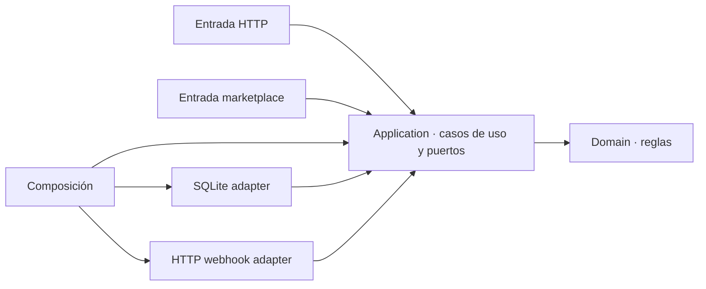

# Clean Architecture

Clean Architecture suele enseñarse al revés: primero aparece un diagrama de círculos, después una lista de capas y al final intentamos decidir dónde poner cada archivo.

Aquí vamos a hacer lo contrario.

Vamos a empezar con una operación pequeña que funciona, **crear una orden**, y no vamos a separar nada hasta que aparezca una causa observable para hacerlo.

!!! important "Regla de trabajo"
    **No movemos una línea de código sin una causa.**

La pregunta que guía toda la lección no es:

> ¿En qué capa debería poner esto?

Es:

> **¿Qué problema justifica esta separación?**

Y hay otra regla igual de importante: si en algún momento la solución actual sigue siendo suficientemente buena, detenerse ahí puede ser la decisión correcta.

## Antes de necesitar arquitectura

### Una creación de orden directa es suficiente

Partimos con una única entrada HTTP.

La operación valida la solicitud, calcula el total, guarda la orden en SQLite y devuelve el resultado.

```csharp
app.MapPost("/orders", async (CreateOrderRequest request) =>
{
    if (request.Items.Count == 0)
    {
        return Results.BadRequest(new
        {
            error = "La orden debe contener al menos un producto."
        });
    }

    if (request.Items.Any(item =>
        item.Quantity <= 0 || item.UnitPrice < 0))
    {
        return Results.BadRequest(new
        {
            error = "Las cantidades deben ser positivas y los precios no pueden ser negativos."
        });
    }

    var total = request.Items.Sum(
        item => item.UnitPrice * item.Quantity);

    var orderId = Guid.NewGuid();

    await using var connection =
        new SqliteConnection(connectionString);

    await connection.OpenAsync();

    var insert = connection.CreateCommand();
    insert.CommandText =
        """
        INSERT INTO orders (id, total)
        VALUES ($id, $total);
        """;

    insert.Parameters.AddWithValue("$id", orderId.ToString());
    insert.Parameters.AddWithValue("$total", total);

    await insert.ExecuteNonQueryAsync();

    return Results.Created(
        $"/orders/{orderId}",
        new CreateOrderResponse(orderId, total));
});
```

No hay caso de uso separado. No hay puerto. No hay adaptador. No hay proyecto `Domain`.

Y todavía no los necesitamos.

El código tiene varias responsabilidades, pero eso por sí solo no demuestra que separarlas produzca una solución mejor. Para el problema actual, la operación sigue siendo pequeña y comprensible.

!!! note "¿Qué pasa si no cambiamos nada?"
    Nada grave. De hecho, **no cambiar nada es la decisión preferida por ahora**.

    Introducir capas, interfaces o proyectos en este punto agregaría estructura antes de que exista una presión que la justifique.

### Una regla empieza a merecer nombre propio

Ahora cambia una sola cosa: calcular el total deja de ser una multiplicación trivial.

Aparecen reglas de promoción:

- desde 100.000 de subtotal elegible se aplica un 10 % de descuento;
- el descuento tiene un máximo de 20.000;
- algunos productos, como `gift-card`, no participan de la promoción.

El cálculo empieza a responder una pregunta propia del problema:

> ¿Cuánto vale realmente esta orden?

```csharp
public static class OrderTotalCalculator
{
    private const decimal DiscountThreshold = 100_000m;
    private const decimal DiscountRate = 0.10m;
    private const decimal MaximumDiscount = 20_000m;

    private static readonly HashSet<string> ExcludedProductIds =
        new(StringComparer.OrdinalIgnoreCase)
        {
            "gift-card"
        };

    public static decimal Calculate(IEnumerable<OrderItem> items)
    {
        var materializedItems = items.ToArray();

        var subtotal = materializedItems.Sum(
            item => item.UnitPrice * item.Quantity);

        var eligibleSubtotal = materializedItems
            .Where(item =>
                !ExcludedProductIds.Contains(item.ProductId))
            .Sum(item => item.UnitPrice * item.Quantity);

        if (eligibleSubtotal < DiscountThreshold)
        {
            return subtotal;
        }

        var discount = Math.Min(
            eligibleSubtotal * DiscountRate,
            MaximumDiscount);

        return subtotal - discount;
    }
}
```

La extracción es pequeña. No construimos una capa de dominio.

Solo reconocemos que un comportamiento adquirió suficiente significado como para poder entenderse y cambiarse por sí mismo.

<div class="teaching-grid teaching-grid--2" markdown>

<div class="teaching-card" markdown>
<span class="teaching-eyebrow">Antes</span>
<strong>El cálculo era incidental</strong>
<span>Precio por cantidad podía leerse cómodamente dentro del flujo de crear una orden.</span>
</div>

<div class="teaching-card" markdown>
<span class="teaching-eyebrow">Ahora</span>
<strong>El cálculo expresa una decisión del problema</strong>
<span>Promociones, exclusiones y límites hacen que la regla tenga identidad propia.</span>
</div>

</div>

!!! note "Contrafactual"
    Si el cálculo siguiera siendo solo `precio × cantidad`, mantenerlo dentro de la operación continuaría siendo razonable.

Separar un comportamiento porque adquirió identidad **no equivale todavía a adoptar Clean Architecture**.

## La operación deja de pertenecer a sus mecanismos

### El segundo punto de entrada

Hasta ahora solo HTTP necesita crear órdenes.

Aparece una integración con un marketplace. Su payload tiene otra forma, pero quiere hacer exactamente lo mismo: crear una orden con las mismas reglas.

<div class="teaching-grid teaching-grid--2" markdown>

<div class="teaching-card" markdown>
<span class="teaching-eyebrow">Entrada HTTP</span>
<strong>`CreateOrderRequest`</strong>
<span>Traduce una petición HTTP a los datos que necesita la operación.</span>
</div>

<div class="teaching-card" markdown>
<span class="teaching-eyebrow">Marketplace</span>
<strong>`MarketplaceOrder`</strong>
<span>Traduce el JSON externo a los mismos datos de creación de orden.</span>
</div>

</div>

Podríamos duplicar validación, cálculo y persistencia en ambas entradas.

También podríamos hacer que una entrada llame a la otra.

Las dos alternativas hacen que un **mecanismo de entrada** termine poseyendo una operación que ambos necesitan.

El cambio mínimo es extraer esa operación:

```csharp
public static class CreateOrder
{
    public static async Task<CreateOrderResult> ExecuteAsync(
        IReadOnlyList<CreateOrderItem> items,
        string connectionString)
    {
        // validar
        // calcular
        // persistir
        // devolver resultado
    }
}
```

Ahora cada entrada hace tres cosas:

1. traduce sus datos;
2. invoca la misma operación;
3. traduce el resultado a su propio mecanismo de salida.

Recién ahora el nombre **caso de uso** (*use case*, operación que representa un objetivo de la aplicación) empieza a ser útil.

!!! note "¿Era obligatorio extraerlo antes?"
    No.

    Con una sola entrada y una operación pequeña, dejar el comportamiento junto al endpoint seguía siendo una decisión defendible.

### Persistir es una capacidad, SQLite es un mecanismo

Ya tenemos un caso de uso compartido.

Pero todavía conoce demasiado sobre cómo se guarda una orden:

```csharp
await using var connection =
    new SqliteConnection(connectionString);

await connection.OpenAsync();

var insert = connection.CreateCommand();
insert.CommandText =
    """
    INSERT INTO orders (id, total)
    VALUES ($id, $total);
    """;

await insert.ExecuteNonQueryAsync();
```

La operación no necesita realmente saber qué es SQLite, cómo se abre una conexión ni qué SQL ejecutamos.

Necesita algo mucho más pequeño:

> **guardar una orden.**

Así que expresamos esa capacidad desde el lado de la operación:

```csharp
public interface IOrderStore
{
    Task SaveAsync(OrderToSave order);
}
```

Y el caso de uso pasa a depender de ella:

```csharp
public static async Task<CreateOrderResult> ExecuteAsync(
    IReadOnlyList<CreateOrderItem> items,
    IOrderStore orders)
{
    var total = OrderTotalCalculator.Calculate(items);
    var order = new OrderToSave(Guid.NewGuid(), total);

    await orders.SaveAsync(order);

    return new CreateOrderResult(
        order.OrderId,
        order.Total);
}
```

SQLite queda afuera realizando esa capacidad.

<div class="teaching-grid teaching-grid--2" markdown>

<div class="teaching-card" markdown>
<span class="teaching-eyebrow">Antes</span>
<strong>El caso de uso conoce SQLite</strong>
<span>La política de crear una orden depende directamente de conexiones, comandos y SQL.</span>
</div>

<div class="teaching-card" markdown>
<span class="teaching-eyebrow">Después</span>
<strong>El caso de uso expresa lo que necesita</strong>
<span>`IOrderStore` describe “guardar una orden”; SQLite realiza esa capacidad desde afuera.</span>
</div>

</div>

Aquí aparece nuestra primera **inversión de dependencia** (*dependency inversion*).

No abstraemos “la base de datos” porque una arquitectura nos diga que debe existir una interfaz.

Expresamos una capacidad porque el caso de uso necesita algo más estable y pequeño que el mecanismo concreto que la realiza.

!!! note "¿Qué pasa si seguimos usando SQLite directo?"
    Si la persistencia es trivial, estable y no interfiere con la evolución de la operación, puede seguir siendo perfectamente razonable.

### La relación aparece otra vez

Ahora aparece una segunda necesidad externa:

> después de crear correctamente una orden, debemos notificarla mediante un webhook HTTP.

Podríamos poner `HttpClient`, la URL, la serialización y el manejo de estados HTTP dentro de `CreateOrder`.

Pero eso reproduce exactamente el problema que acabamos de observar con SQLite.

La operación necesita:

> **notificar que una orden fue creada.**

```csharp
public interface IOrderCreatedNotifier
{
    Task NotifyAsync(
        OrderCreatedNotification notification);
}
```

El caso de uso ahora expresa dos capacidades:

```csharp
public static async Task<CreateOrderResult> ExecuteAsync(
    IReadOnlyList<CreateOrderItem> items,
    IOrderStore orders,
    IOrderCreatedNotifier notifier)
{
    var total = OrderTotalCalculator.Calculate(items);
    var order = new OrderToSave(Guid.NewGuid(), total);

    await orders.SaveAsync(order);

    await notifier.NotifyAsync(
        new OrderCreatedNotification(
            order.OrderId,
            order.Total));

    return new CreateOrderResult(
        order.OrderId,
        order.Total);
}
```

Y un mecanismo HTTP la realiza desde afuera:

```csharp
public sealed class HttpOrderCreatedNotifier(
    HttpClient httpClient,
    Uri endpoint) : IOrderCreatedNotifier
{
    public async Task NotifyAsync(
        OrderCreatedNotification notification)
    {
        using var response = await httpClient.PostAsJsonAsync(
            endpoint,
            new
            {
                notification.OrderId,
                notification.Total
            });

        response.EnsureSuccessStatusCode();
    }
}
```

<div class="teaching-grid teaching-grid--2" markdown>

<div class="teaching-card" markdown>
<span class="teaching-eyebrow">Persistencia</span>
<strong>Guardar orden</strong>
<span>La operación expresa `IOrderStore`; SQLite realiza esa capacidad.</span>
</div>

<div class="teaching-card" markdown>
<span class="teaching-eyebrow">Notificación</span>
<strong>Notificar orden creada</strong>
<span>La operación expresa `IOrderCreatedNotifier`; HTTP realiza esa capacidad.</span>
</div>

</div>

La misma forma apareció dos veces:

```text
política → capacidad necesaria ← mecanismo externo
```

Recién ahora los términos **puerto** (*port*, capacidad que la aplicación expone o requiere) y **adaptador** (*adapter*, mecanismo concreto que conecta esa capacidad con el exterior) empiezan a aportar lenguaje.

No porque hayamos decidido aplicar “Ports and Adapters” como plantilla, sino porque ya necesitamos describir una relación que observamos repetidamente.

!!! warning "Una tensión real que no vamos a esconder"
    Si SQLite guarda la orden y después falla el webhook, ambos efectos no son atómicos.

    Esta lección no introduce outbox, reintentos, mensajería ni transacciones distribuidas para hacer desaparecer el problema. Esa sería otra pregunta y requeriría otra causa.

## Las responsabilidades toman forma

### Reglas del problema y coordinación

Miremos lo que ahora hace `CreateOrder`.

Hay decisiones que cambian cuando cambia **la orden**:

- qué cantidades son válidas;
- qué productos participan de promociones;
- cuándo se aplica un descuento;
- cuánto puede descontarse.

Y hay decisiones que cambian cuando cambia **el proceso para crearla**:

- guardar;
- notificar;
- devolver el resultado.

Son razones de cambio diferentes.

| Responsabilidad | Cambia cuando... |
| --- | --- |
| Regla de la orden | cambia una condición o política del problema |
| Caso de uso | cambia cómo coordinamos el objetivo |

Ahora tiene sentido separar ambas responsabilidades.

El dominio queda encargado de producir una orden válida y calculada:

```csharp
public sealed class Order
{
    public Guid Id { get; }

    public decimal Total { get; }

    public static Order Create(
        IReadOnlyList<OrderLine> lines)
    {
        // validar reglas de la orden
        // calcular el total según sus políticas

        return new Order(
            Guid.NewGuid(),
            calculatedTotal);
    }
}
```

Y la aplicación coordina qué hacemos con ese resultado:

```csharp
public static async Task<CreateOrderResult> ExecuteAsync(
    IReadOnlyList<CreateOrderItem> items,
    IOrderStore orders,
    IOrderCreatedNotifier notifier)
{
    var order = Order.Create(
        items
            .Select(item => new OrderLine(
                item.ProductId,
                item.Quantity,
                item.UnitPrice))
            .ToArray());

    await orders.SaveAsync(
        new OrderToSave(order.Id, order.Total));

    await notifier.NotifyAsync(
        new OrderCreatedNotification(
            order.Id,
            order.Total));

    return new CreateOrderResult(
        order.Id,
        order.Total);
}
```

Ahora sí los nombres **dominio** (*Domain*) y **aplicación** (*Application*) describen algo que podemos observar:

- **dominio**: reglas del problema que podemos comprender sin saber cómo se ejecuta el sistema;
- **aplicación**: coordinación necesaria para alcanzar un objetivo usando esas reglas y las capacidades disponibles.

!!! note "La carpeta no creó la frontera"
    Primero observamos dos responsabilidades que cambian por razones distintas.

    Después usamos proyectos separados para mantener visible esa frontera.

    El `.csproj` no es la evidencia de que exista un dominio.

Y tampoco acabamos de demostrar que cada aplicación necesite un proyecto `Domain`.

Si las reglas fueran pequeñas y solo tuvieran sentido dentro de este caso de uso, mantenerlas juntas podría seguir siendo más claro.

### Alguien tiene que conectar todo

Llegados a este punto ya tenemos piezas concretas:

- `SqliteOrderStore`;
- `HttpOrderCreatedNotifier`;
- `CreateOrder`;
- entradas HTTP y marketplace.

Alguien tiene que decidir qué realizaciones usamos y cómo las construimos.

En una primera versión, ambas entradas podían hacer algo así:

```csharp
var orders =
    new SqliteOrderStore("Data Source=orders.db");

await orders.InitializeAsync();

var notifier = new HttpOrderCreatedNotifier(
    new HttpClient(),
    new Uri("http://localhost:5099/order-created"));
```

Eso mantiene el conocimiento concreto fuera del dominio y de la aplicación, pero empieza a duplicarse entre los dos mecanismos de entrada.

La presión ya no es “Application conoce SQLite”.

La presión real es:

> **varios mecanismos de entrada están repitiendo el mismo conocimiento de ensamblaje.**

Así que le damos un lugar explícito a la composición:

```csharp
public static class OrderApplicationComposition
{
    public static async Task<OrderApplication> CreateAsync()
    {
        var orders =
            new SqliteOrderStore("Data Source=orders.db");

        await orders.InitializeAsync();

        var notifier = new HttpOrderCreatedNotifier(
            new HttpClient(),
            new Uri(
                "http://localhost:5099/order-created"));

        return new OrderApplication(
            orders,
            notifier);
    }
}
```

Las entradas siguen sabiendo de HTTP o del formato del marketplace.

Pero dejan de saber qué base de datos elegimos, qué implementación notifica, qué URL usamos o cómo inicializamos esas piezas.

!!! note "Composition root no significa contenedor de DI"
    Un **punto de composición** (*composition root*) es el lugar donde decidimos y conectamos las realizaciones concretas.

    Aquí seguimos construyendo todo explícitamente. No necesitamos un contenedor adicional de inyección de dependencias.

## Recién ahora podemos llamarla Clean Architecture

### Reconstruir antes de nombrar

Hasta este punto no necesitábamos empezar por el nombre.

Podemos reconstruir lo que ocurrió:

<div class="teaching-flow teaching-flow--multiline">

<div class="teaching-flow__row">

<div class="teaching-flow__step teaching-flow__step--numbered">
<span class="teaching-flow__marker">1</span>
<strong>Las entradas traducen</strong>
<span>HTTP y marketplace convierten sus formatos al lenguaje de la operación.</span>
</div>

<div class="teaching-flow__arrow" aria-hidden="true">→</div>

<div class="teaching-flow__step teaching-flow__step--numbered">
<span class="teaching-flow__marker">2</span>
<strong>El caso de uso coordina</strong>
<span>Crear una orden deja de pertenecer a cualquiera de sus entradas.</span>
</div>

<div class="teaching-flow__arrow" aria-hidden="true">→</div>

<div class="teaching-flow__step teaching-flow__step--numbered">
<span class="teaching-flow__marker">3</span>
<strong>Las reglas toman identidad</strong>
<span>La validez y el cálculo pueden entenderse sin infraestructura.</span>
</div>

</div>

<div class="teaching-flow__row">

<div class="teaching-flow__step teaching-flow__step--numbered">
<span class="teaching-flow__marker">4</span>
<strong>Las capacidades se expresan adentro</strong>
<span>Application declara qué necesita para persistir y notificar.</span>
</div>

<div class="teaching-flow__arrow" aria-hidden="true">→</div>

<div class="teaching-flow__step teaching-flow__step--numbered">
<span class="teaching-flow__marker">5</span>
<strong>Los mecanismos quedan afuera</strong>
<span>SQLite y HTTP realizan esas capacidades sin ser conocidos por las políticas.</span>
</div>

<div class="teaching-flow__arrow" aria-hidden="true">→</div>

<div class="teaching-flow__step teaching-flow__step--numbered teaching-flow__step--accent">
<span class="teaching-flow__marker">6</span>
<strong>La composición conecta todo</strong>
<span>Un lugar externo conoce qué realizaciones concretas ejecutarán el sistema.</span>
</div>

</div>

</div>

<div class="visual-equivalent visual-equivalent--subtle" markdown>
En texto: las entradas traducen hacia un caso de uso; el caso de uso coordina reglas del dominio y capacidades externas; los mecanismos concretos realizan esas capacidades desde afuera; un punto de composición selecciona y conecta esos mecanismos.
</div>

La forma resultante ahora sí puede describirse usando ideas asociadas con **Clean Architecture**:

- las políticas importantes no necesitan conocer detalles externos para funcionar;
- los casos de uso coordinan objetivos;
- las reglas del problema pueden mantenerse independientes de mecanismos;
- las capacidades requeridas se expresan desde el lado que las necesita;
- los mecanismos externos realizan esas capacidades;
- la selección concreta ocurre hacia afuera.

El nombre describe una forma que emergió.

No fue la premisa desde la que empezamos.

### La regla de dependencias

Veamos ahora la topología de conocimiento de código.



<div class="visual-equivalent visual-equivalent--subtle" markdown>
La entrada HTTP y la entrada marketplace conocen Application. Application conoce Domain. Los adapters de SQLite y webhook conocen los puertos definidos por Application. Composition conoce Application y los adapters concretos para ensamblarlos. Domain no conoce ninguna de esas piezas externas.
</div>

Este dibujo representa **dependencias de código**, no el flujo temporal de una petición.

La idea importante puede formularse así:

> **El código que expresa políticas más estables no necesita depender de detalles de implementación menos estables para realizar su trabajo.**

Eso es lo que la **regla de dependencias** (*dependency rule*) nos ayuda a preservar.

No significa que cada proyecto deba apuntar físicamente hacia un círculo central ni que una carpeta llamada `Domain` garantice automáticamente una buena arquitectura.

Lo que importa es qué conocimiento exigimos a cada parte y qué razones de cambio estamos haciendo viajar a través de nuestras fronteras.

### Lo que no se volvió obligatorio

Nada en el recorrido demostró que Clean Architecture exija universalmente lo siguiente:

<div class="teaching-grid teaching-grid--2 teaching-grid--lateral-badges">

<div class="teaching-item teaching-item--criterion">
<span class="teaching-item__marker">1</span>
<strong>Cuatro proyectos</strong>
<span>La estructura física puede ayudar a representar fronteras, pero no las crea por sí sola.</span>
</div>

<div class="teaching-item teaching-item--criterion">
<span class="teaching-item__marker">2</span>
<strong>Repository Pattern</strong>
<span>`IOrderStore` nació de una capacidad concreta, no de una plantilla de repositorios.</span>
</div>

<div class="teaching-item teaching-item--criterion">
<span class="teaching-item__marker">3</span>
<strong>Unit of Work</strong>
<span>Este caso no produjo una presión que necesitara introducirlo.</span>
</div>

<div class="teaching-item teaching-item--criterion">
<span class="teaching-item__marker">4</span>
<strong>MediatR o CQRS</strong>
<span>Un caso de uso no necesita un mediator ni separar comandos y consultas para existir.</span>
</div>

<div class="teaching-item teaching-item--criterion">
<span class="teaching-item__marker">5</span>
<strong>DDD completo</strong>
<span>Separar reglas del problema no convierte automáticamente la solución en Domain-Driven Design.</span>
</div>

<div class="teaching-item teaching-item--criterion">
<span class="teaching-item__marker">6</span>
<strong>Una interfaz por clase</strong>
<span>Las interfaces aparecieron cuando una política necesitó expresar una capacidad, no como decoración preventiva.</span>
</div>

</div>

Tampoco todas las aplicaciones tienen que recorrer todo este camino.

Podríamos habernos detenido correctamente antes de extraer un caso de uso, antes de invertir persistencia, antes de separar dominio y aplicación o antes de crear una unidad de composición.

La arquitectura no es una puntuación que haya que maximizar.

Es una respuesta a presiones.

!!! success "El criterio que queremos conservar"
    Cuando aparezca una nueva carpeta, interfaz, capa, puerto, adaptador o abstracción, recuerda volver a la pregunta: **¿Qué problema justifica esta separación?**

    Si todavía no tenemos una respuesta observable, quizá todavía no necesitamos mover esa línea.


<div class="teaching-exploration" data-teaching-exploration markdown>

## Explora esta lección

<div class="teaching-exploration__intro" markdown>
¿Hay algo de esta lección que quieras llevar más lejos?

Describe **qué te gustaría entender** y Teaching preparará un texto orientativo usando el material pedagógico de esta lección. Si no eliges un modo concreto, el LLM podrá seleccionar entre las exploraciones que esta lección soporta.

Todo se prepara localmente en tu navegador. **Teaching no envía lo que escribas a ningún LLM ni a ningún servidor.** Tú decides dónde usar el resultado.
</div>

<div class="teaching-exploration__composer">

<label for="clean-architecture-exploration-need">¿Qué te gustaría entender?</label>

<textarea id="clean-architecture-exploration-need" data-exploration-need placeholder="Por ejemplo: entiendo la idea de invertir la dependencia de SQLite, pero me gustaría verla en un sistema que trabaja con archivos locales."></textarea>

<div class="teaching-exploration__settings">

<label for="clean-architecture-exploration-mode">¿Cómo quieres explorarlo?</label>

<select id="clean-architecture-exploration-mode" data-exploration-mode>
<option value="automatic" data-prompt-src="explorations/automatic.txt" data-description="Interpreta tu necesidad y elige una de las exploraciones soportadas, explicando cuál escogió y por qué.">Automático — deja que Teaching oriente el tipo de exploración</option>
<option value="another-case" data-prompt-src="explorations/another-case.txt" data-description="Recorre las mismas presiones en otro dominio sin copiar artificialmente la arquitectura final.">Otro caso</option>
<option value="deepen" data-prompt-src="explorations/deepen.txt" data-description="Examina una tensión, un concepto ya introducido o una extensión natural del caso con más detalle.">Profundizar</option>
<option value="apply-to-my-case" data-prompt-src="explorations/apply-to-my-case.txt" data-description="Parte de tu sistema y comprueba qué presiones de la lección existen realmente, sin forzar la arquitectura final sobre él.">Aplicarlo a mi caso</option>
<option value="test-me" data-prompt-src="explorations/test-me.txt" data-description="Convierte el recorrido en decisiones progresivas y te deja decidir antes de revelar la transición siguiente.">Ponme a prueba</option>
</select>

<div class="teaching-exploration__help">
<strong>¿Qué significa este modo?</strong>
<p data-exploration-help>Interpreta tu necesidad y elige una de las exploraciones soportadas, explicando cuál escogió y por qué.</p>
</div>

</div>

<div class="teaching-exploration__actions">
<button type="button" class="teaching-exploration__button teaching-exploration__button--primary" data-exploration-prepare>Preparar exploración</button>
</div>

<p class="teaching-exploration__status" data-exploration-status role="status" aria-live="polite"></p>

<div class="teaching-exploration__result" data-exploration-result hidden>
<label for="clean-architecture-exploration-output">Texto preparado para tu LLM</label>
<textarea id="clean-architecture-exploration-output" data-exploration-output readonly></textarea>

<div class="teaching-exploration__actions">
<button type="button" class="teaching-exploration__button" data-exploration-copy>Copiar texto</button>
</div>
</div>

</div>

</div>

---

Esta lección fue diseñada y materializada con ayuda de IA a partir de una [fuente pedagógica reproducible](generation-instructions.md) y de un recorrido técnico validado por etapas. El código ejecutable que sirvió como evidencia vive en `examples/clean-architecture/` dentro del repositorio.
